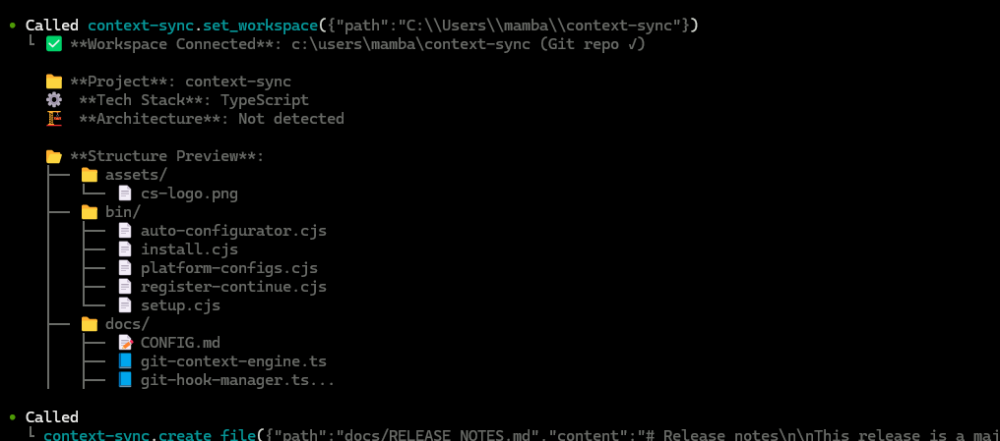

# Context Sync

Local-first memory layer for AI development tools via MCP.



## Install and auto-config (60 seconds)
1) Install globally:
```bash
npm install -g @context-sync/server
```

2) Auto-config runs on install. Restart your AI tool.

3) Verify tools:
- Claude Desktop: Tools list
- Cursor: Tools list
- VS Code/Copilot: Copilot Chat -> Agent mode -> Tools
- Continue.dev: open Continue panel
- Codex CLI: codex mcp list
- Claude Code: claude mcp list

If auto-config fails, see `docs/TROUBLESHOOTING.md` and `docs/CONFIG.md`.
If you installed locally (non-global), auto-config does not run.

## Optional: Notion setup
```bash
context-sync-setup
# or
npx context-sync-setup
```

## Supported platforms
- Claude Desktop
- Cursor
- VS Code + GitHub Copilot
- Continue.dev
- Zed
- Windsurf
- Codeium
- TabNine
- Codex CLI
- Claude Code
- Antigravity (Google Gemini IDE)

## First-time workflow
```text
1) set_project({ path: "/abs/path/to/project" })
2) recall()
3) read_file({ path: "src/index.ts" })
4) remember({ type: "decision", content: "Use SQLite for local storage" })
```

Tool reference: `docs/TOOLS.md`

## Data and config
- Database: `~/.context-sync/data.db`
- Config: `~/.context-sync/config.json`
- Install status: `~/.context-sync/install-status.json`
- Custom DB: `context-sync --db-path /absolute/path/to/db` or `CONTEXT_SYNC_DB_PATH`

More details: `docs/DATA.md`

## Git hooks
When you run `set_project` inside a git repo, Context Sync installs hooks:
- post-commit
- pre-push
- post-merge
- post-checkout

Hooks are marked with "Context Sync Auto-Hook" and existing hooks are backed up.

## Docs
- Release notes: `docs/RELEASE_NOTES.md`
- Manual config: `docs/CONFIG.md`
- Tools: `docs/TOOLS.md`
- Troubleshooting: `docs/TROUBLESHOOTING.md`
- Data and storage: `docs/DATA.md`
