# Context Sync 🧠
<div align="center">

<!-- HERO BANNER -->


<br><br>

### **Build in Cursor. Continue in Claude Desktop. Your AI remembers everything.**

<br>

<!-- PLATFORM BADGES - PROMINENT -->
<p>
  
  
  
</p>

<!-- VERSION BADGES -->
<p>
  <a href="https://www.npmjs.com/package/@context-sync/server">
    
  </a>
  <a href="https://github.com/Intina47/context-sync/stargazers">
    
  </a>
  <a href="https://www.npmjs.com/package/@context-sync/server">
    
  </a>
  
  
</p>

<!-- SOCIAL PROOF -->
<p>
  <strong>20+ GitHub stars in 24 hours</strong> • <strong>400+ downloads Launch Week</strong> • <strong>#17 Product Hunt</strong>
</p>

<!-- PRODUCT HUNT -->

<a href="https://www.producthunt.com/products/context-sync-local-mcp-server?embed=true&utm_source=badge-featured&utm_medium=badge&utm_source=badge-context&#0045;sync" target="_blank"></a>
<br>

---

**Stop re-explaining your projects to AI. Build seamlessly across Cursor and Claude Desktop.**

<sub>Local-first • 2-minute setup • Works with your existing workflow</sub>

</div>

<br>

---

<br>

## 😤 You Know This Pain

You're building with AI. You've explained your project architecture, tech stack, and design decisions. 

**Then you hit a limit. New chat. Claude forgot everything.**

<table>
<tr>
<td width="50%" valign="top">

### ❌ Without Context Sync

**Monday in Cursor:**
```
You: "Building TaskFlow - Next.js app with Supabase"
AI: "Great! Let's start..."
*3 hours of coding*
```

**Tuesday in Claude Desktop:**
```
You: "Continue TaskFlow"
AI: "What's TaskFlow? Please explain your project"
```

**😡 You spend 30 minutes re-explaining. Every. Single. Day.**

</td>
<td width="50%" valign="top">

### ✅ With Context Sync

**Monday in Cursor:**
```
You: "Building TaskFlow - Next.js app with Supabase"
AI: "Great! Let's start..."
*3 hours of coding*
```

**Tuesday in Claude Desktop:**
```
You: "Continue TaskFlow"
AI: "Continuing your Next.js app with Supabase.
     What feature should we add next?"
```

**😊 AI just remembers. Works everywhere.**

</td>
</tr>
</table>

**Context Sync syncs your AI context between Cursor and Claude Desktop automatically.**

<br>

---

<br>

## 🎯 Who This Is For

<table>
<tr>
<td width="50%">

### ✅ Perfect For You If:

- You use **Cursor AND Claude Desktop**
- Building **long-term projects** (weeks/months)
- Tired of **re-explaining context**
- Switch between AI tools frequently
- Freelancer juggling multiple projects
- Want AI that **actually remembers**

</td>
<td width="50%">

### ❌ Not For You If:

- Only use AI for one-off questions
- Don't use Cursor or Claude Desktop
- Happy manually copying context
- Casual AI user (not building projects)
- Prefer cloud-based solutions

</td>
</tr>
</table>

<br>

---

<br>

## 🚀 2-Minute Setup

**No configuration files. No API keys. No complexity.**

<table>
<tr>
<td align="center" width="33%">

### 1️⃣ Install
⏱️ 30 seconds

```bash
npm install -g @context-sync/server
```

One command. Global install.

</td>
<td align="center" width="33%">

### 2️⃣ Restart
⏱️ 30 seconds

**Claude Desktop:**
- Mac: `⌘ + Q`
- Windows: Right-click tray

**Cursor:**
- Refresh MCP servers

</td>
<td align="center" width="33%">

### 3️⃣ Done! ✨
⏱️ 1 minute

```
You: "help context-sync"
```

Context Sync is running!
Follow the guided setup!

</td>
</tr>
</table>

<div align="center">

**Total time: 2 minutes • Zero configuration • Works immediately**

</div>

### 👋 First Time? Start Here!

**Complete beginner setup:**

1. **Install:** `npm install -g @context-sync/server`
2. **Restart Claude Desktop:**
   - Mac: `⌘ + Q` (force quit from menu)
   - Windows: Right-click tray icon → Exit
3. **In Claude Desktop, type:** `"help context-sync"`
4. **Follow the guided setup!** ✅ You're done!
<br>

### 🔧 Setup for Cursor

<details>
<summary><b>Quick Setup for Cursor (30 seconds)</b></summary>
<br>

After installing Context Sync, in Claude Desktop type:

```
setup cursor
```

Claude will give you OS-specific instructions! ✨

</details>

<details>
<summary><b>Manual Cursor Setup</b></summary>
<br>

1. Open Cursor: `Settings → MCP`

2. Add this configuration:
```json
{
  "mcpServers": {
    "context-sync": {
      "command": "npx",
      "args": ["-y", "@context-sync/server"]
    }
  }
}
```

3. Refresh MCP servers

4. Test: `"What's my current project?"`

Done! ✅

</details>

<br>

---

<br>

## 🔄 How It Works

<div align="center">

```
┌─────────────┐                    ┌──────────────────┐                    ┌─────────────┐
│   Cursor    │ ────────────────>  │  Context Sync    │ <──────────────── │   Claude    │
│     IDE     │   Saves context    │   (Your Machine) │   Loads context   │   Desktop   │
└─────────────┘                    └──────────────────┘                    └─────────────┘
                                            │
                                            │ SQLite Database
                                            │ ~/.context-sync/
                                            ▼
                                    ┌──────────────────┐
                                    │  • Projects      │
                                    │  • Decisions     │
                                    │  • Architecture  │
                                    │  • TODOs         │
                                    │  • Code Context  │
                                    └──────────────────┘
```

</div>

**100% Local • You Own Your Data • No Cloud • Open Source**

<br>

---

<br>

## ⚡ Key Features

<table>
<tr>
<td align="center" width="33%">
  <h2>🔄</h2>
  <h3>Cross-Platform Sync</h3>
  <p>Start in Cursor, continue in Claude Desktop. Context follows you automatically.</p>
  <sub><strong>This is the main feature</strong></sub>
</td>
<td align="center" width="33%">
  <h2>🧠</h2>
  <h3>Perfect Memory</h3>
  <p>Close everything. Come back next week. AI remembers your entire project.</p>
  <sub><strong>Never re-explain again</strong></sub>
</td>
<td align="center" width="33%">
  <h2>🔒</h2>
  <h3>Local & Private</h3>
  <p>SQLite database on your machine. No cloud. No tracking. You own everything.</p>
  <sub><strong>100% under your control</strong></sub>
</td>
</tr>
</table>

### 📦 What Gets Synced:

- ✅ Project name, description, tech stack
- ✅ Architecture decisions and reasoning
- ✅ TODOs and task lists
- ✅ Code context (files, dependencies, types)
- ✅ Conversation summaries
- ✅ Git status and branches

### 💡 Smart Token Usage:

**Uses only 1-3K tokens** (not full conversation dumps)

Think of it like:
- ❌ Loading your entire codebase into RAM
- ✅ An IDE that loads files as you need them

Context Sync stores **structured summaries**. AI queries for details on-demand. You never saturate the context window.

<br>

---

<br>

## 🆚 How Is This Different?

### vs Claude's `/compact` command

<table>
<tr>
<td width="50%">

**`/compact` command:**
- Compresses ONE conversation
- Saves tokens in current chat
- Stays in same conversation
- Temporary solution

</td>
<td width="50%">

**Context Sync:**
- Works across ALL conversations
- Permanent memory forever
- Works across platforms (Cursor ↔ Claude)
- Complete solution

</td>
</tr>
</table>

**They're complementary!** Use `/compact` for long chats, Context Sync for project memory.

---

### vs Claude Pro subscription

<table>
<tr>
<td width="50%">

**Claude Pro ($20/month):**
- ✅ More messages per day
- ✅ Longer context window
- ✅ Priority access
- ❌ Still forgets between chats

</td>
<td width="50%">

**Context Sync (Free):**
- ✅ Permanent memory across chats
- ✅ Cross-platform sync
- ✅ Local storage (you own it)
- ✅ Works with Pro or Free tier

</td>
</tr>
</table>

**You need both:** Claude Pro for more messages, Context Sync for memory.

---

### vs basic-memory

<table>
<tr>
<td width="50%">

**basic-memory:**
- Simple context storage
- Claude Desktop only
- Basic features

</td>
<td width="50%">

**Context Sync:**
- ✅ Cross-platform (Cursor ↔ Claude)
- ✅ Advanced code analysis
- ✅ TODO management
- ✅ Git integration
- ✅ File operations
- ✅ Active development

</td>
</tr>
</table>

**Different needs:** basic-memory for simple storage, Context Sync for full dev workflow.

---

### vs Traycer

<table>
<tr>
<td width="50%">

**Traycer:**
- Web wrapper around Claude
- Cloud-based
- Self-contained app

</td>
<td width="50%">

**Context Sync:**
- ✅ Works with native tools (Cursor + Claude Desktop)
- ✅ Local-first (your machine)
- ✅ Cross-platform sync
- ✅ Open source

</td>
</tr>
</table>

**Different approach:** Traycer = new interface, Context Sync = enhance existing tools.

<br>

---

<br>

## 💬 Common Questions

<details>
<summary><b>Why isn't this built into Claude already?</b></summary>
<br>

**Honest answer:** Business incentives.

If Claude remembered everything perfectly:
- You'd have shorter conversations
- Use fewer messages
- Hit rate limits slower

Persistent memory makes AI more useful but potentially less profitable for AI companies.

**That's why Context Sync is:**
- Open source (no profit motive)
- Local-first (you own your data)
- Community-driven (built by developers, for developers)

</details>

<details>
<summary><b>Won't this fill up my context window?</b></summary>
<br>

**No!** Context Sync uses only **1-3K tokens per project**.

**How it works:**
1. Stores structured summaries (not full conversations)
2. AI queries for details on-demand via MCP
3. Never dumps everything into a new chat

**Analogy:**
- ❌ Bad: Loading 10GB codebase into RAM
- ✅ Good: IDE that loads files as needed

**Example:**
- Your 10K line project with 50 decisions
- Context Sync summary: ~1.5K tokens
- AI queries for specific details when needed

You never saturate because you're not copying conversations - you're giving AI access to a queryable database.

</details>

<details>
<summary><b>Is my data safe and private?</b></summary>
<br>

**100% local. 100% yours.**

- ✅ SQLite database on YOUR machine
- ✅ No cloud sync (unless you configure it)
- ✅ No data sent to our servers (we don't have servers!)
- ✅ Open source - audit the code yourself
- ✅ Delete anytime - just remove `~/.context-sync/`

**Database location:**
- Mac/Linux: `~/.context-sync/data.db`
- Windows: `%USERPROFILE%\.context-sync\data.db`

**You control everything.**

</details>

<details>
<summary><b>Does this work with VS Code?</b></summary>
<br>

**Coming in v0.6.0!** (Next 6-8 weeks)

VS Code extension is our **most requested feature** from launch day.

Want to be notified when it's ready?
- ⭐ Star the repo
- 👀 Watch releases
- 💬 Join discussions

**Currently works with:**
- ✅ Cursor IDE (full support)
- ✅ Claude Desktop (full support)

</details>

<details>
<summary><b>Does this work with Claude Code CLI?</b></summary>
<br>

**Also coming in v0.6.0!**

Claude Code just launched and supports MCP, so integration should be straightforward.

We're prioritizing:
1. VS Code extension
2. Claude Code CLI
3. Better onboarding

**Want it sooner?** Let us know in [GitHub Discussions](https://github.com/Intina47/context-sync/discussions)!

</details>

<details>
<summary><b>Can I use this on mobile?</b></summary>
<br>

**Not yet.** Mobile requires:
- Claude mobile app to support MCP (not available yet)
- OR a custom mobile app (planned for future)

**Current workaround:**
- Use Claude.ai web on mobile (read-only)
- Full features on desktop only

Mobile support depends on Anthropic adding MCP to their mobile app.

</details>

<details>
<summary><b>How much does this cost?</b></summary>
<br>

**Context Sync is 100% free and open source** (MIT License).

**Why free?**
- Built by developers, for developers
- Solves a problem we personally had
- Community-driven development
- No profit motive = no business incentives to limit features

**You might pay for:**
- Claude Pro subscription (recommended but not required)
- Your time (2 minutes to set up)

That's it!

</details>

<details>
<summary><b>What if I have multiple projects?</b></summary>
<br>

**Context Sync handles multiple projects beautifully!**

```bash
You: "Switch to my blog project"
AI: [loads blog context instantly]

You: "List my projects"
AI: 
  1. TaskFlow (Next.js + Supabase)
  2. Personal Blog (Astro)
  3. Client Website (WordPress)

You: "Switch to TaskFlow"
AI: [back to TaskFlow context]
```

Each project maintains its own:
- Architecture decisions
- Tech stack
- TODOs
- Code context
- Conversation history

</details>

<br>

---

<br>

## 🎬 Real-World Example

### Freelance Developer Workflow

**Monday Morning (Cursor):**
```
You: "Initialize project 'EcommerceClient' - Next.js 14, Stripe, PostgreSQL"
AI: "Project created! ✓"
*Build product catalog for 3 hours*
```

**Tuesday Afternoon (Claude Desktop):**
```
You: "Continue EcommerceClient - add shopping cart"
AI: "Adding cart to your Next.js app with Stripe integration.
     Using the product schema we defined yesterday..."
```

**Wednesday (Cursor):**
```
You: "Switch back to Cursor. Review cart implementation"
AI: "Analyzing cart code... found 2 potential improvements..."
```

**No re-explaining. No context loss. Just continuous progress across tools.**

<br>

---

<br>

## 🗺️ Roadmap

<table>
<tr>
<td align="center" width="33%">
  <h3>✅ v0.5.0 - Current</h3>
  <sub>Released October 2025</sub>
  <br><br>
  ✓ Cross-platform sync<br>
  ✓ TODO management<br>
  ✓ Code analysis tools<br>
  ✓ Git integration<br>
  ✓ 50+ MCP tools
</td>
<td align="center" width="33%">
  <h3>🔄 v0.6.0 - Next</h3>
  <sub>6-8 weeks</sub>
  <br><br>
  • VS Code extension<br>
  • Claude Code CLI<br>
  • Better onboarding<br>
  • Improved docs<br>
  • Performance optimization
</td>
<td align="center" width="33%">
  <h3>🔮 Future</h3>
  <sub>Coming later</sub>
  <br><br>
  • Mobile support<br>
  • Team collaboration<br>
  • Analytics dashboard<br>
  • More platforms<br>
  • Advanced features
</td>
</tr>
</table>

**See detailed roadmap:** [ROADMAP.md](ROADMAP.md)

<br>

---

<br>

## 📊 Stats

<div align="center">


<br><br>

**Recent milestones:**
- 🎉 26 stars in first 24 hours
- 📦 400+ npm downloads in launch week
- 🚀 #17 on Product Hunt
- 💬 20K+ Reddit impressions

</div>

<br>

---

<br>

## 🛠️ Advanced Features

<details>
<summary><b>Full Feature List</b></summary>
<br>

### Project Management
- Initialize and switch between projects
- Track architecture and tech stack
- Store design decisions with reasoning
- Manage TODOs and priorities

### Code Analysis
- Dependency graph analysis
- Function call traces
- Type definition lookup
- Find all references
- Impact analysis

### File Operations
- Read project structure
- Search files and content
- Modify files (with approval)
- Preview changes before applying

### Git Integration
- Status and diff viewing
- Branch information
- Commit message suggestions
- Change tracking

### Cross-Platform
- Seamless Cursor ↔ Claude sync
- Platform-specific optimizations
- Context handoff automation

### Developer Tools
- 50+ MCP tools
- Extensible architecture
- TypeScript + SQLite
- Open source

</details>

<br>

---

<br>

## 🤝 Contributing

We love contributions! Here's how to help:

<table>
<tr>
<td align="center" width="25%">
  <h3>🐛</h3>
  <strong>Report Bugs</strong>
  <br><br>
  <a href="https://github.com/Intina47/context-sync/issues">Create Issue</a>
</td>
<td align="center" width="25%">
  <h3>💡</h3>
  <strong>Request Features</strong>
  <br><br>
  <a href="https://github.com/Intina47/context-sync/discussions">Start Discussion</a>
</td>
<td align="center" width="25%">
  <h3>🛠️</h3>
  <strong>Submit Code</strong>
  <br><br>
  <a href="CONTRIBUTING.md">See Guide</a>
</td>
<td align="center" width="25%">
  <h3>📚</h3>
  <strong>Improve Docs</strong>
  <br><br>
  <a href="https://github.com/Intina47/context-sync/tree/main/documentation">Help Here</a>
</td>
</tr>
</table>

**See:** [CONTRIBUTING.md](CONTRIBUTING.md) for detailed guidelines.

<br>

---

<br>

## 🌟 Community

<div align="center">

<a href="https://github.com/Intina47/context-sync/discussions">
  
</a>
<a href="https://www.producthunt.com/posts/context-sync">
  
</a>
<a href="https://twitter.com/intent/tweet?text=Check%20out%20Context%20Sync%20-%20AI%20context%20sync%20for%20Cursor%20and%20Claude!&url=https://github.com/Intina47/context-sync">
  
</a>

<br><br>

**Show your support:** Give us a ⭐ on GitHub!

<br>

<a href="https://github.com/Intina47/context-sync/stargazers">
  
</a>

</div>

<br>

---

<br>

## 🔧 Troubleshooting

<details>
<summary><b>Claude Desktop doesn't see Context Sync</b></summary>
<br>

1. Verify installation:
```bash
context-sync --version
```

2. Check config file:
```bash
# Mac/Linux
cat ~/.config/Claude/claude_desktop_config.json

# Windows
type %APPDATA%\Claude\claude_desktop_config.json
```

3. Restart Claude completely:
- Mac: `⌘ + Q` (force quit)
- Windows: Right-click tray icon → Exit

4. Check MCP servers in Claude: Look for Context Sync in settings

Still stuck? [Create an issue](https://github.com/Intina47/context-sync/issues)

</details>

<details>
<summary><b>Cursor doesn't see Context Sync</b></summary>
<br>

1. Open Cursor settings: `Settings → MCP`

2. Verify configuration exists:
```json
{
  "mcpServers": {
    "context-sync": {
      "command": "npx",
      "args": ["-y", "@context-sync/server"]
    }
  }
}
```

3. Refresh MCP servers in Cursor

4. Test: Ask AI "What's my current project?"

</details>

<details>
<summary><b>"No active project" error</b></summary>
<br>

Initialize a project first:

```bash
You: "Initialize project 'test-app'"
```

Or switch to existing:

```bash
You: "What projects do I have?"
You: "Switch to [project-name]"
```

</details>

<details>
<summary><b>Context not syncing between platforms</b></summary>
<br>

1. Check platform status:
```bash
You: "Check platform status"
```

2. Verify both platforms are configured

3. Try manual sync:
```bash
You: "Sync context to Cursor"
```

</details>

**More help:** [TROUBLESHOOTING.md](TROUBLESHOOTING.md)

<br>

---

<br>

## 📄 License

MIT License - see [LICENSE](LICENSE) file for details.

**TL;DR:** Use it however you want. Commercial, personal, modify, distribute. Just keep the license.

<br>

---

<br>

## 🙏 Acknowledgments

**Built with:**
- [Model Context Protocol](https://modelcontextprotocol.io/) by Anthropic
- [TypeScript](https://www.typescriptlang.org/)
- [SQLite](https://www.sqlite.org/)

**Special thanks:**
- Every developer who gave feedback on launch day
- Early adopters who believed in the vision
- The Claude AI community
- Contributors who helped build this

**Built by developers tired of explaining the same thing 47 times.**

<br>

---

<br>

<div align="center">

## 💝 Support the Project

**If Context Sync saves you time:**

- ⭐ Star the repo
- 🐦 Share on Twitter
- 👍 Upvote on Product Hunt
- 💬 Tell other developers
- 🛠️ Contribute code or docs

**Every bit helps more developers discover this tool!**

<br>

---

<br>

**Made with ❤️ by developers who were tired of re-explaining their projects**

<br>

[⬆ Back to Top](#-context-sync)

<br>

<sub>© 2025 Context Sync • Open Source • MIT License</sub>

</div>
